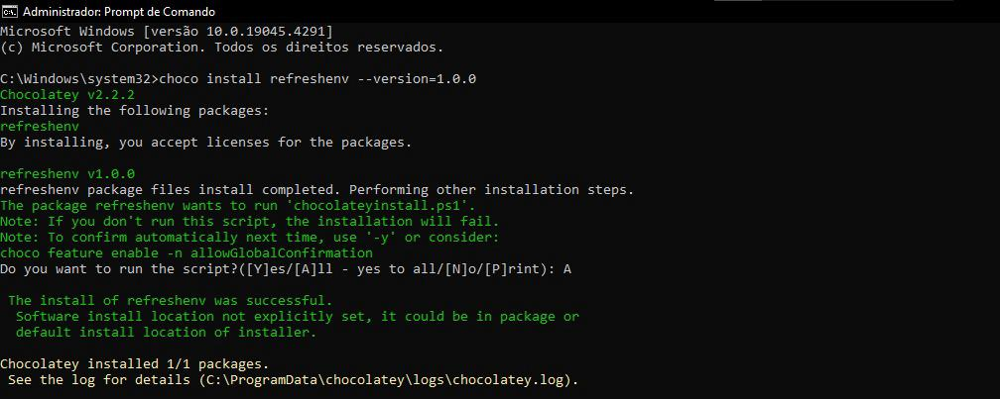

# Pacote Chocolatey REnv 

Este é um pacote Chocolatey que instala um script PowerShell chamado REnv, que pode ser usado para atualizar as variáveis de ambiente no prompt de comando sem precisar fechá-lo e abri-lo novamente.

## Instalação

Para instalar o pacote REnv, certifique-se de ter o Chocolatey instalado no seu sistema. Em seguida, execute o seguinte comando no prompt de comando:

>choco install renv --version=0.0.1

Este comando instalará o script REnv e configurará automaticamente para ser carregado sempre que um novo shell for iniciado.

## Uso

Após a instalação, você pode usar o script REnv para atualizar as variáveis de ambiente no prompt de comando. Basta digitar `renv` e pressionar Enter.

## Desinstalação

Para desinstalar o pacote REnv, execute o seguinte comando no prompt de comando:

> choco uninstall renv

Isso removerá o script REnv do seu sistema.

## Contribuições

Se você encontrar algum problema ou tiver sugestões de melhorias, sinta-se à vontade para abrir uma issue ou enviar um pull request neste repositório no GitHub.

## Colaboradores

Agradecemos a esses incríveis colaboradores que ajudaram a tornar este projeto possível:

<table>
  <tr>
    <td align="center">
      <a href="https://github.com/espinhara">
         
        
          <b>Gabriel Espinhara</b>
        
      </a>
    </td>
    <td align="center">
      <a href="https://github.com/matheuslanduci">
         
        
          <b>Mathues Landuci</b>
        
      </a>
    </td>
  </tr>
</table>

## Licença

Este pacote está licenciado sob a [MIT License](LICENSE.md).
